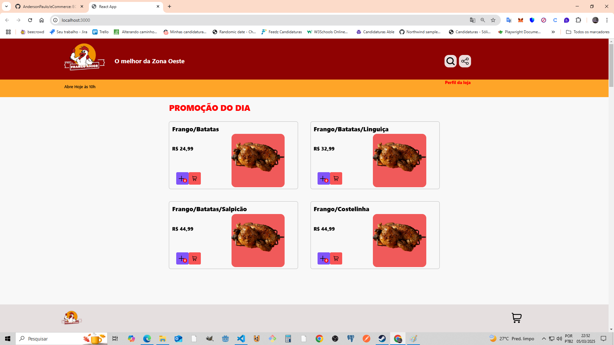

# 🐔 Frango Delivery - Ecommerce Responsivo  

Este é um projeto de estudo e prática de desenvolvimento web e automação, onde criamos uma plataforma de vendas e delivery de frango. A aplicação é responsiva, permitindo que usuários naveguem e realizem pedidos tanto no celular quanto no desktop.  

## Layout




## 🚀 Tecnologias Utilizadas  

- **Frontend:** ReactJS, JavaScript, HTML, CSS  
- **Backend:** SQLite (futuro desenvolvimento)  
- **Metodologia:** Scrum e Agile  
- **Objetivo Secundário:** Estudo de automação de testes com Cypress/Playwright e Postman  

## 🎯 Funcionalidades  

✅ Pesquisa de itens no catálogo  
✅ Adição de produtos ao carrinho  
✅ Finalização de pedidos  
✅ Design responsivo para mobile e desktop  

## 📌 Como Rodar o Projeto  

### 1️⃣ Clonar o repositório  
```bash
git clone https://github.com/AndersonPaulo/eCommerce
```

### 2️⃣ Instalar dependências  
```bash
npm install
```

### 3️⃣ Rodar a aplicação  
```bash
npm start
```

O projeto será executado em `http://localhost:3000`.  

## 🔧 Implementações Futuras  

- Backend com SQLite  
- Sistema de login e autenticação  
- Métodos de pagamento  
- Testes automatizados com Cypress/Playwright e Postman  

## 📢 Contribuição  

Este é um projeto de aprendizado, então qualquer sugestão ou feedback são bem-vindos!  

